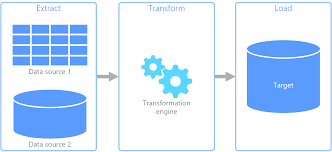

# ETL Project:
## Project Name: Climate Action - Reduce Air Pollution
### Members: Harini Rao, Margeaux Jensen, Neelam Baxi, Zen Acar

#### Sources of Data:
-	Kaggle - US Pollution Data - https://www.kaggle.com/sogun3/uspollution -  (2000-2016) CSV 
-	OECD - Air Emmisions by Source - https://stats.oecd.org/index.aspx?lang=en - (2000-2016) CSV

	
#### Transformation:
-	Air Emmisions by Source Dataset Cleaning:
	-	Removed the columns for Country, COU, Pollutant, YEA, Unit Code, PowerCode Code, PowerCode, Reference 			Period Code, Reference Period, Flag Codes, and Flags. 
	-	Dropped rows that had data for other pollutants. We were only focusing on the yearly values for Nitrogen Dioxide, 			Sulphur Dioxide, and Carbon Monoxide.
	-	Renamed the pollutants so that they matched our other dataset. We also changed the name for "VAR" and "Variable" columns to "pol_var" and "pol_variable". 
	-	Then, we separated the data into 3 dataframes, based on pollutant, and wrote them each to a CSV file. 

-	US Pollution Data Cleaning:
	-	Removed State Code, County Code, Site Num, Address, County, City, O3 Units, O3 Mean, O3 1st Max Value, O3 1st Max Hour, 		O3 AQI, NO2 1st Max Value, NO2 1st Max Hour, NO2 AQI,SO2 1st Max Value, SO2 1st Max Hour, SO2 AQI, CO 1st Max Value, CO 		1st Max Hour, CO AQI
	-	Aggregated the Mean columns and separate by year (columns) and pollutants (rows)
	- 	Converted the values column from Parts per Billion to Gram/Ton

#### Final Production Database: Relational Database - PostgreSQL

#### The final tables used in the production database:
	mod_mean_us_pollution
	mod_pollution_year_city
	mod_pollution_year_state
	mod_cleaned_air_emission_by_source_co
	mod_cleaned_air_emission_by_source_no2
	mod_cleaned_air_emission_by_source_so2
